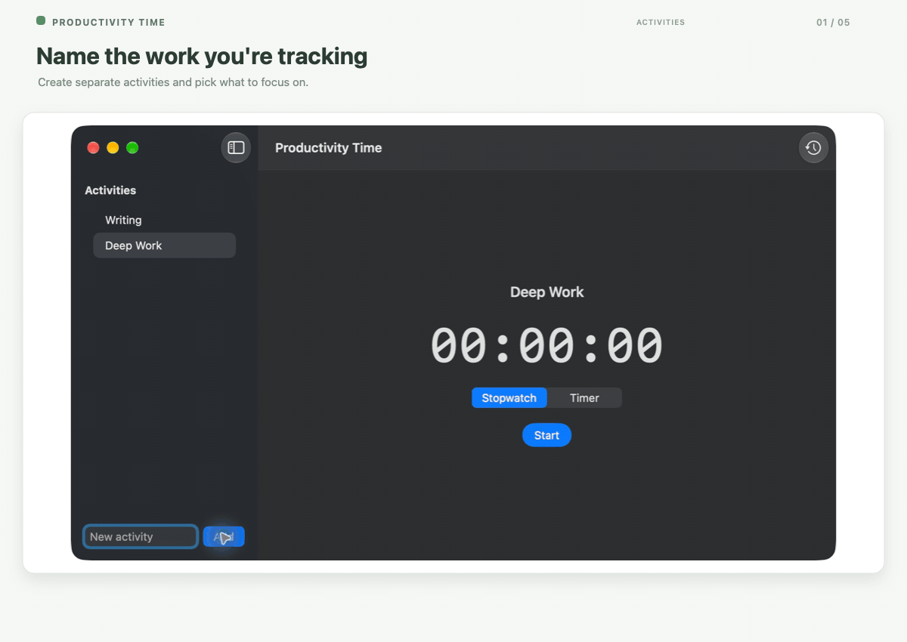

# Productivity Time

A native macOS app for tracking focused activities with a stopwatch or countdown timer. Completed sessions are saved locally and delivered independently to Apple Notes and Notion.

## Features

- Create, rename, pin, and remove activities.
- Track an activity with a stopwatch or a countdown timer. Timers include 5, 25, and 50 minute presets and a custom duration from 1 minute to 24 hours.
- Record a stopwatch session when you complete it. Pausing or discarding a stopwatch does not create a session. A timer is recorded when it reaches zero; cancelling it does not create a session.
- Review completed sessions and their Apple Notes and Notion delivery states. Retry a failed destination without resending to the other one.
- Resume or discard a session that was paused when the app quit. Time while the app is closed is not counted.
- Receive an optional macOS notification when a timer completes.

## Demo



[Watch the walkthrough as MP4](docs/media/productivity-time-demo.mp4).

## Requirements

- macOS 14 or later
- Xcode 16 or later, with the macOS SDK
- Apple Notes for Notes delivery
- A Notion workspace and internal integration for Notion delivery (optional)

## Download

Download the latest macOS disk image from [ProductivityTime.dmg](https://github.com/ismailucrn/productivity-time/releases/latest/download/ProductivityTime.dmg). Open it and drag **ProductivityTime.app** to **Applications**. The app is ad hoc signed and not notarized, so macOS may require you to approve opening it in **System Settings → Privacy & Security**.

The project uses Swift 6, SwiftUI, SwiftData, and system frameworks. It has no third-party package dependencies.

## Build and run

Open `ProductivityTime.xcodeproj` in Xcode, select the `ProductivityTime` scheme, and run it on this Mac.

To create a macOS app and an installable disk image with the selected soft sage clock icon, run:

```sh
./scripts/package-macos.sh
```

The checked-in `ProductivityTime/Resources/ProductivityTime-Icon-Source.png` is the source artwork. Packaging clips only to the rounded-square app icon frame, generates all ICNS sizes and a preview from that PNG, and verifies that the ICNS bytes match in the app and disk image. The script builds a universal Release app and writes `dist/ProductivityTime.app` and `dist/ProductivityTime.dmg`. Open the DMG and drag **ProductivityTime.app** onto the **Applications** shortcut. The app is ad hoc signed for local use and is not notarized; distributing it to other Macs requires signing with a Developer ID and notarizing it.

To build from Terminal, keep build products inside the repository:

```sh
xcodebuild \
  -project ProductivityTime.xcodeproj \
  -scheme ProductivityTime \
  -destination 'platform=macOS' \
  -derivedDataPath .build/DerivedData \
  build
```

To run the unit and UI test suites:

```sh
xcodebuild \
  -project ProductivityTime.xcodeproj \
  -scheme ProductivityTime \
  -destination 'platform=macOS' \
  -derivedDataPath .build/DerivedData \
  test
```

## Connect Apple Notes

1. Open **Settings** from the app and choose the target note name. The default is `Productivity Time Sessions`.
2. Choose **Test Connection**.
3. When macOS asks, allow Productivity Time to control Notes under **System Settings → Privacy & Security → Automation**.

The app finds or creates the named note and adds one line per completed session with its activity, mode, duration, and local completion time. A failed delivery can be retried from History.

## Connect Notion

1. Create an internal integration in your Notion workspace and grant it permission to read and add content.
2. Create a database/data source for sessions and share it with that integration.
3. Add these properties with the exact names and types below:

   | Property | Type |
   | --- | --- |
   | `Name` | Title |
   | `Mode` | Rich text |
   | `Duration` | Rich text |
   | `Date` | Date |
   | `Session ID` | Rich text |

4. In Productivity Time **Settings**, enter the data source ID and integration token, choose **Save**, then choose **Test Connection**.

The integration token is stored in the macOS Keychain. The data source ID is a non-secret preference. A successful connection test also attempts delivery of pending Notion sessions. Each Notion session includes a stable session ID so retries can find an existing page instead of creating a duplicate. Pending deliveries are also retried when the app launches; failed deliveries remain available from History.

## Local data and privacy

Activities, completed sessions, active-session recovery state, and destination delivery states are stored locally with SwiftData. Apple Notes receives a formatted session line; Notion receives a page with the session details. Delivery state is tracked separately for each destination, so an outage or permission issue in one does not hide the status of the other.

The app does not provide account login, cloud sync, telemetry, or a background service. Notion credentials are kept in Keychain and are not part of the project files. Notification access is optional and is not required to complete or deliver sessions.

## Project layout

```text
ProductivityTime/
  App/             App entry point, lifecycle, and application model
  Domain/          Timer state machine, clock, and validated values
  Features/        Activities, timer, history, and settings UI
  Integrations/    Apple Notes, Notion, notifications, and delivery coordination
  Persistence/     SwiftData models and session repository
ProductivityTimeTests/
  App/ Domain/ Features/ Integrations/ Persistence/ TestSupport/
```

## License

This repository does not currently include a license file.
